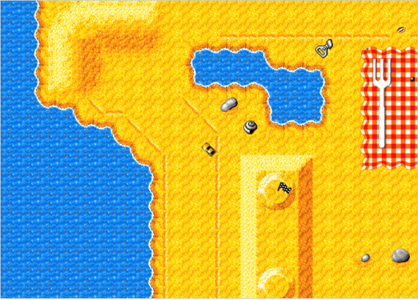

## Building Micro Machines using object-oriented JavaScript

### August 30th 2018

---

### What we will cover

* How to model our game using JavaScript classes/objects
* How polymorphism works in JavaScript
* How to get our racing game working and playable
* If we have time, adding a functional AI opponent

*Bear in mind that this is a code-along!*

---

### What this is not

* A boring theoretical introduction to OOP
* Some OOP knowledge is required!

---

## Prerequisites

---

* A terminal
* A web browser
* A text editor (Visual Studio Code)
* Node.js v8.9.4
* NPM v5.6.0

*Please double check you have the correct versions of Node/NPM*

---

## Let's go!

---

### Please clone the following repository from Github

#### https://github.com/kslat3r/micro-machines

* Checkout the branch `step-one`

---

## Building the game

---

### Steps to complete:

* `npm install`
* `npm run watch` (this will run watch and build on any file changes)
* Open `dist/index.html` in your browser
* You will need to refresh your browser after file changes

---

## Introduction to the game

---

---

### Introduction to the codebase

---

## Adding our first class - Track

### Please checkout branch `step-one`

---

### Steps to complete:

* Create a file called `game/track.js`
* Create a class called `Track`
* Add a constructor method
* Add a method called `draw`
* Populate our class functionality
* Create an instance of this class in `game/index.js`

---

## Adding a parent class - Car

### Please checkout branch `step-two`

---

### Steps to complete:

---

## Adding a child class - PlayerCar

### Please checkout branch `step-three`

---

### Specs to complete:

---

## Adding our AI opponent class - AICar

### Please checkout branch `step-four`

---

### Steps to complete:

---

### Thank-you all very much!